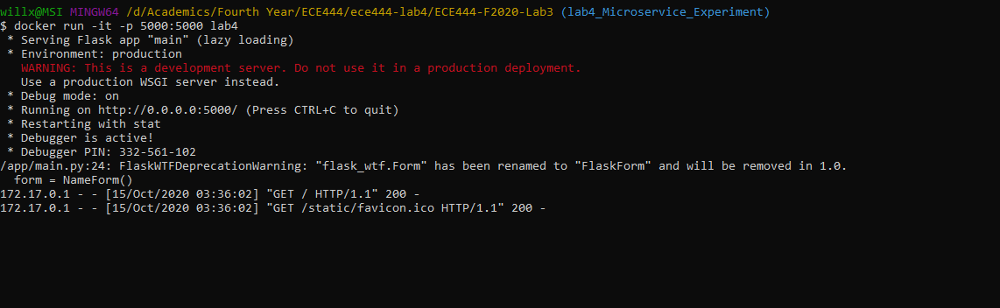
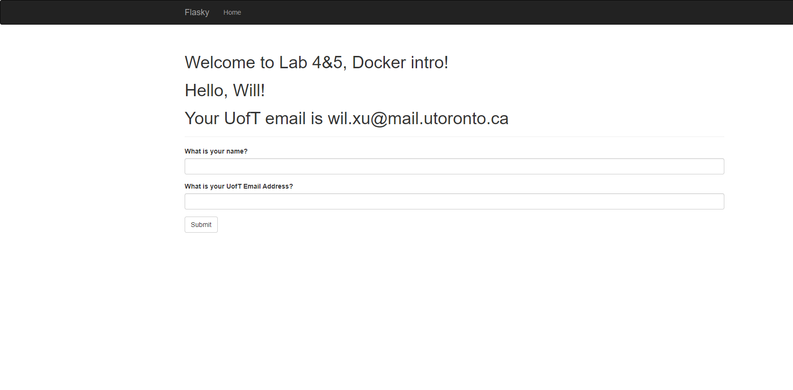
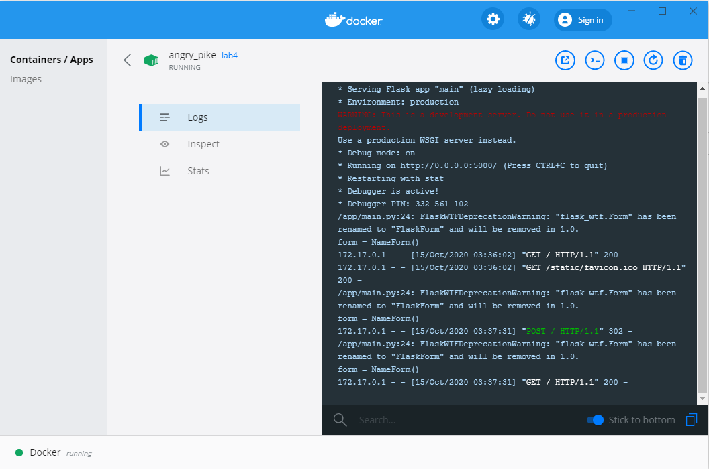

# ECE444-F2020-Lab4&5

Name: Yudong (Will) Xu

This repo is a clone of
https://github.com/miguelgrinberg/flasky

## Activity 2
to build the system: navigate to the root folder and run the following command:

`docker build -t lab4:latest .`

to run the system, run the following command:

`docker run -it -p 5000:5000 lab4`

if you see something like this, the system is running successfully:

navigate to http://localhost:5000/ in your browser, you should see the running application

you can use docker desktop app to to manage the running container

## Activity 3

A virtual machine (VM) can be think of as essentially a separate computer running on the host computer, 
it has its own operating system and (virtualized) hardware.
VMs are useful for running apps that require a lot of the operating system’s resources.
However, a VM requires a lot of extra overhead beyond the applications it runs since it also need to run the OS and manage the virtualized hardware.

A Docker container is simply a running process that is separate from the system, it does not run its own operating system and virtualized hardware. 
It shares the host OS with other containers, interacts with its own filesystems and include everything needed to run an application.
Therefore, it is smaller, faster and more portable than VMs. 

