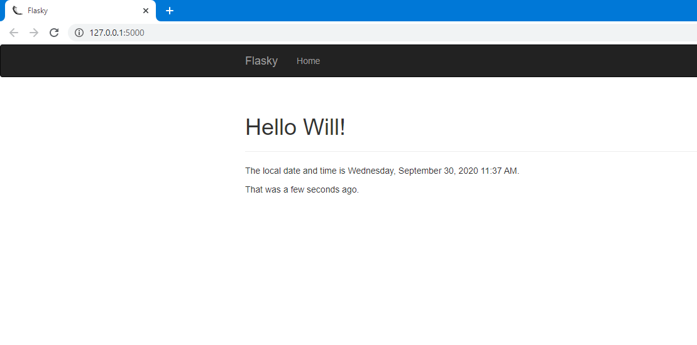
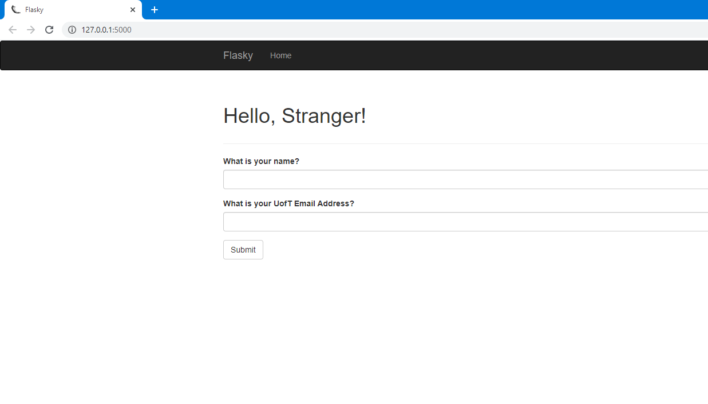

# ECE444-F2020-Lab3

Name: Yudong (Will) Xu

This repo is a clone of
https://github.com/miguelgrinberg/flasky

## Activity 1

## Activity 2

## Activity 3

A database stores application related data in an organized way. The application can query the database for any information they need.
SQL and NoSQL are the two types of databases.

SQL is a relational database, it stores data in tables with fixed number of columns and variable rows. The tables have a special column called
the primary key that stores a unique identifier for each row. They can also have columns called foreign keys that links to other tables primary keys.
Because of these links called relationships, SQL is able to store structured data efficiently and avoid duplication.

NoSQL does not follow the relational model, it stores data in collections and documents. 
NoSQL operations can be a lot more expensive due to there being a lot of duplicated data that all needs to be operated on, 
at the same time, the duplication allows for faster querying.
